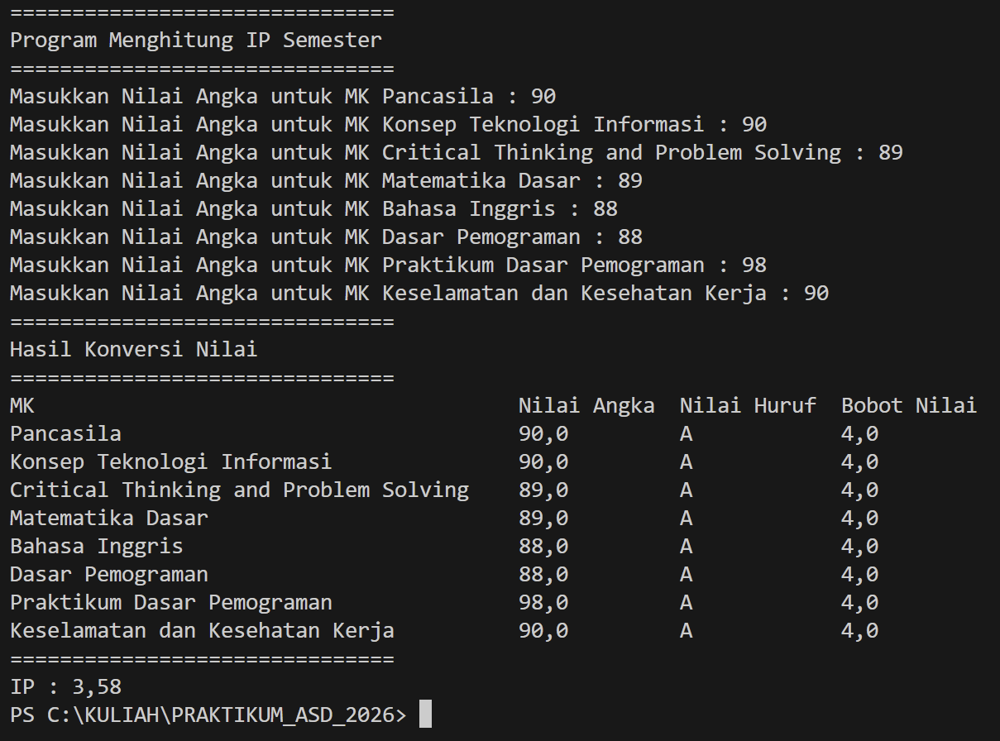
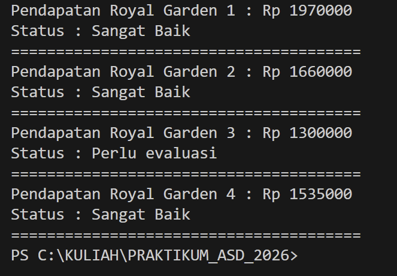

|  | Algoritma dan Struktur Data |
|--|--|
| NIM |  254107020202|
| Nama |  Cindy Callista N |
| Kelas | TI - 1F |
| Repository | [link] https://github.com/cindnath-tech/PRAKTIKUM_ASD_2026/tree/main/src/P1 |

# Jobsheet 1 - Konsep Dasar Pemograman

## 1.1 Praktikum Pemilihan

Hasil jika nilai valid :

Hasil jika nilai tidak valid :

## 1.2 Praktikum Perulangan

Hasil dari perulangan dengan 2 digit terkahir NIM : 12

## 1.3 Praktikum Array

Hasil array menghitung IP Semester :

## 1.4 Praktikum Fungsi

Hasil fungsi menghitung pendapatan :

## 1.5 Tugas 1

Hasil array kode plat mobil :

## 1.6 Tugas 2

Hasil fungsi mencari jadwal kulaih :

