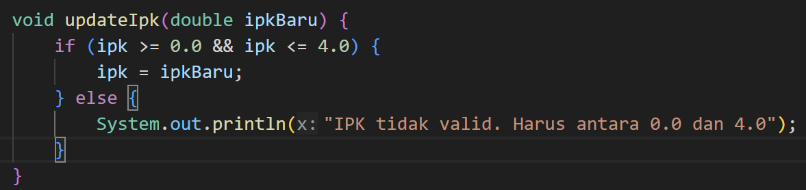

|  | Algoritma dan Struktur Data |
|--|--|
| NIM |  254107020202|
| Nama |  Cindy Callista N |
| Kelas | TI - 1F |
| Repository | [link] https://github.com/cindnath-tech/PRAKTIKUM_ASD_2026 |

# Jobsheet 2 - Object

## 2.1 Percobaan 1

Hasil dari percobaan 1 :

### Pertanyaan Percobaan 1 :
1. Sebutkan dua karakteristik class atau object! 

    - Class memiliki dua karakteristik adalah memiliki atribut dan method/fungsi

2. Perhatikan class Mahasiswa pada Praktikum 1 tersebut, ada berapa atribut yang dimiliki oleh class 
Mahasiswa? Sebutkan apa saja atributnya! 

    - Ada 4 yaitu nama, nim, kelas, dan ipk

3. Ada berapa method yang dimiliki oleh class tersebut? Sebutkan apa saja methodnya! 

    - Ada 4 yaitu tampilkanInformasi(), ubahKelas(), updateIpk(), dan nilaiKinerja()

4. Perhatikan method updateIpk() yang terdapat di dalam class Mahasiswa. Modifikasi isi method 
tersebut sehingga IPK yang dimasukkan valid yaitu terlebih dahulu dilakukan pengecekan apakah 
IPK yang dimasukkan di dalam rentang 0.0 sampai dengan 4.0 (0.0 <= IPK <= 4.0). Jika IPK tidak 
pada rentang tersebut maka dikeluarkan pesan: "IPK tidak valid. Harus antara 0.0 dan 4.0". 

5. Jelaskan bagaimana cara kerja method nilaiKinerja() dalam mengevaluasi kinerja mahasiswa,  
kriteria apa saja yang digunakan untuk menentukan nilai kinerja tersebut, dan apa yang 
dikembalikan (di-return-kan) oleh method nilaiKinerja() tersebut? 

    - nilaikerja() akan menerima nilai ipk lalu dilakukan pengecekan nilai ipk dengan kondisi jika nilai ipk >= 3.5 maka kinerja sangat baik, jika >= 3.0 maka kinerja baik, jika >= 2.0 maka kinerja cukup, dan selain kondisi tersebut kinerja kurang. Hasil dari kondisi tersebut akan dikembalikan untuk ditampilkan ketika method dipanggil